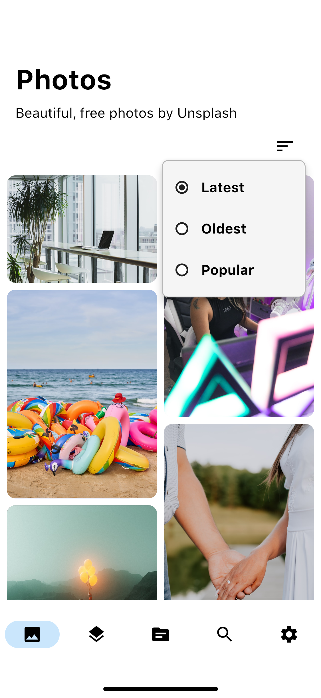
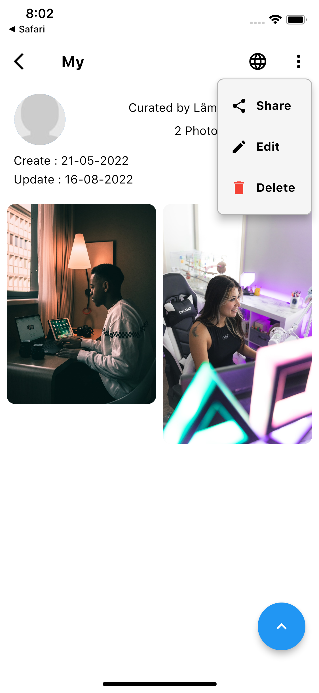
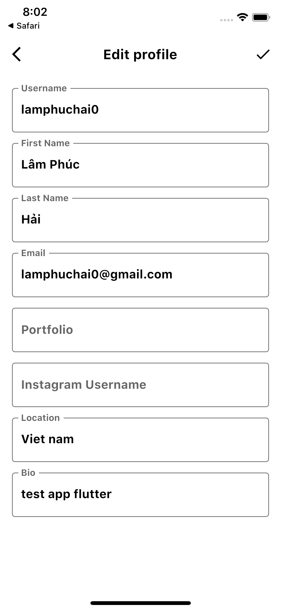

# HDSPLASH APP

## Introduction
The app uses the unsplash api to view photos, collections, topics, search and log in to an unsplash account to perform basic tasks.
- [Video demo](https://www.youtube.com/watch?v=0HPunV5OalU&t)
## Contents
   - [Features](#features)
   - [Setups](#setups)
   - [Screens](#screens)
   - [Library and technology](#library-and-technology)


## **Features**
- Photos:
    * List photos
    * Detail photo
    * Download photo
- Collections:
    * List collections
    * Detail collection
- Topics :
    * List topics
    * Detail topic
- Search :
    * Photo
    * Collection
    * User
- Login to the app using Unsplash:
    * View profile
    * Edit profile
    * Collection:
        * Create new collection
        * Edit collection 
        * Delete collection
    * Photo:
        * Like photo
        * Unlike photo
        * Add photo in collection
        * Remove photo in collection
- Setting:
    * Language:
        * UN
        * VN
    * Theme :
        * System
        * Light
        * Dark
    * Layout gird:
        * 1
        * 2
        * 3


## **Setups**
- Clone repository:
    ```
    $ git clone https://github.com/lamphuchai/hd_splash_flutter_app
- Create app on [unsplash](https://unsplash.com/developers) to get Access Key and Secret Key
- Thêm key Access Key và Secret Key vào Hdsplash

    ```path
    path : hd_splash_flutter/lib/app/config/app_const.dart
    ```
    ```dart
    static const String clientId = "Access Key";
    static const String clientSecret = "Secret Key";
    ```
- Run command directory project Hdsplash:
    ```
    $ flutter pub get
- Then open the development tool and run the application on the virtual machine.


## **Screens**
- [Photos](#photos)
- [Collections](#collections)
- [Topics](#topics)
- [Search](#search)
- [Setting](#setting)
- [User](#user)

### **Photos**

</a>
</a>
</a>
</a>
</a>
</a>
</a>
</a>
</a>
</a>

### **Collections**

</a>
</a>
</a>
</a>
</a>
</a>
</a>
</a>
</a>
</a>


### **Topics**

</a>
</a>
</a>
</a>
</a>
</a>
</a>

### **Tìm kiếm**

</a>
</a>
</a>
</a>
</a>

### **Cài đặt**

</a>
</a>
</a>
</a>
</a>
</a>
</a>
</a>

### **User**

</a>
</a>
</a>
</a>
</a>
</a>
</a>
</a>
</a>
</a>


## **Library and technology**

*   [Unsplash Api](https://unsplash.com/developers)
*	[Flutter](https://flutter.dev/)
*	[Pub.dev](https://pub.dev/)
*	[Bloc](https://github.com/felangel/bloc)
